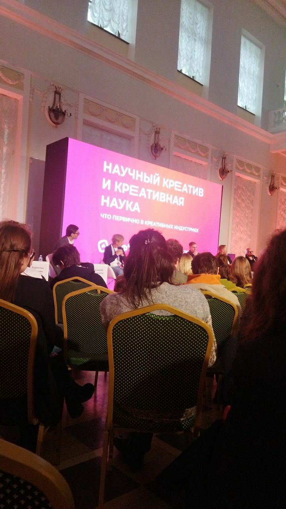
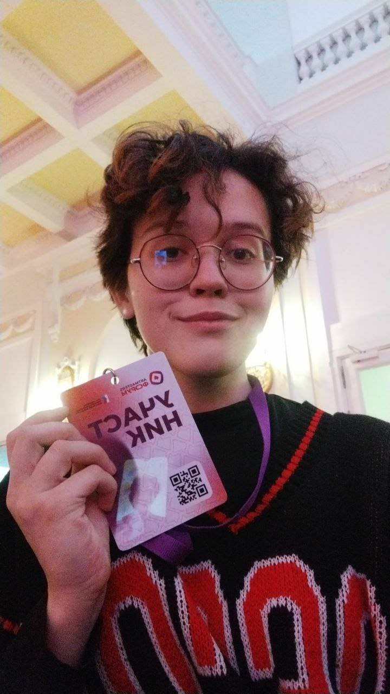

# Отчет о посещении мероприятия Art Masters «Научный креатив и креативная наука: что первично в креативных индустриях?»

## Введение

**Цели мероприятия:**

1. Соединение науки и искусства. Демонстрация, как научные методы (например, ИИ, биоарт, сайнс-арт) могут быть инструментами для творчества.

*Примеры:* создание генеративного искусства с помощью нейросетей, проекты на стыке биологии и дизайна.

2. Развитие междисциплинарных навыков. Обучение участников применять научные подходы (анализ данных, эксперименты) в креативных индустриях — от дизайна до кино.

Практические воркшопы по использованию технологий (VR, 3D-моделирование) в искусстве.

3. Поддержка инновационных проектов. Выявление и продвижение проектов, где наука и творчество взаимно обогащают друг друга (например, интерактивные инсталляции с AR).

Гранты и менторская программа для лучших работ.

4. Популяризация науки через искусство
Создание доступных форматов: научные перфомансы, арт-эксперименты для детей (например, мастер-классы по химии через искусство).

5. Коллаборации ученых и художников для объяснения сложных концепций (квантовая физика в VR-арте).

**Дата и место проведения:** 5 апреля 17:00-20:00 (3 часа), Государственная российская библиотека имени Ленина

**Организаторы:** Президентский фонд креативных инициатив, Форум ArtMasters, Московский политехнический университет

## Описание мероприятия

**Формат мероприятия:** Лекция, мастер-класс, форум

**Спикеры/кураторы:** 

•	Володин Борислав Борисович — Директор АНО «Национальный открытый Чемпионат творческих компетенций ArtMasters»

•	Гофман Александр Михайлович — Директор центра «Креатех» МГТУ им. Н.Э. Баумана

•	Каленчук Алексей Павлович — Директор по цифровым креативным индустриям Фонда «Сколково», автор профессионального блога о технологиях и поп-культуре «Ныряем» @letsdivein

•	Тимащук Евгений Анатольевич — Сооснователь международного продакшена LYM, генеральный и технический продюсер

•	Перегудов Павел Георгиевич — Медиапродюсер, основатель первого в России конкурса Ai-фильмов «MyFilm»

•	Булгаков Алексей Борисович — Сооснователь компании ELKRUFF, технический директор шоу на Дворцовой площади "Алые Паруса"

•	Грибов Артем Сергеевич — Композитор, аранжировщик, двухкратный финалист Чемпионата АртМастерс в компетенции медиакомпозитор, автор гимна Форума ArtMasters

## Программа мероприятия: 

**1. Основные темы и направления**

Связь науки и искусства:

Обсуждение, как научные методы (ИИ, биоарт, нейротехнологии) становятся инструментами для создания искусства. Примеры: генеративное искусство на основе алгоритмов, проекты на стыке биологии и дизайна.

Креативные технологии:

Воркшопы по использованию VR, 3D-моделирования и промт-инженерии в дизайне, кино и музыке.

**2. Форматы активностей**

Панельные дискуссии:

Участвовали эксперты из сферы медиа, IT и искусства. 

Темы:

«Как ИИ меняет креативные профессии?» (с примерами из компетенций чемпионата ArtMasters, таких как «Промт-инженер» и «Дизайнер виртуальных миров»).

«Наука как источник вдохновения для художников» — кейсы из проектов финалистов чемпионата.

**Практические мастер-классы:**

Создание интерактивных инсталляций с AR/VR.

Разбор использования данных (например, визуализация научных концепций через искусство).

**Презентации проектов:**

Финалисты ArtMasters представили работы, где научные исследования легли в основу творческих решений (например, клипы с нейросетевой анимацией или архитектурные проекты с экологичными материалами)

## 1. Введение: новый виток синтеза науки и искусства

Мероприятие Art Masters 2025 года стало знаковым событием, обозначившим принципиально новый этап взаимодействия научного и творческого сообществ. Если раньше наука и искусство существовали как параллельные вселенные, то сегодня мы наблюдаем их активное взаимопроникновение. Современные технологии создали уникальную среду, где художники используют научные методы как кисти и краски, а ученые заимствуют у искусства язык образов и метафор для объяснения сложных концепций.

Особую актуальность этой теме придает стремительное развитие искусственного интеллекта — инструмента, который одинаково востребован и в исследовательских лабораториях, и в творческих мастерских. Именно поэтому центральным вопросом мероприятия стало выяснение того, что первично в современных креативных индустриях — научный подход или творческое начало.

## 2. Научный креатив: когда алгоритмы становятся соавторами
Одной из наиболее обсуждаемых тем стала концепция научного креатива — использования строгих научных методов в творческом процессе.

**2.1. ИИ как новый участник творческого процесса**

В ходе панельной дискуссии "Искусственный интеллект: помощник или конкурент?" эксперты пришли к неожиданному выводу: современные нейросети — это не просто инструменты, а полноценные соавторы. Профессор МГУ Ирина Смирнова привела яркий пример: их лаборатория разработала алгоритм, который анализирует научные статьи по квантовой физике и генерирует на их основе поэтические произведения.

"Это не просто механическая трансформация терминов в рифмы, — подчеркнула Смирнова. — Алгоритм улавливает эмоциональный фон исследований и выражает его через метафоры. Получается своеобразный мост между сухим языком науки и образным языком искусства."

**2.2. Биоарт: живое как художественный медиум**

Особый интерес вызвал мастер-класс по биоарту, где участники работали с настоящими культурами бактерий. 

Художник-биотехнолог Алексей Петров показал, как колонии микроорганизмов можно "запрограммировать" на создание узоров:
"Мы используем принципы химической морфогенезии — те самые, что отвечают за формирование пятен на шкуре леопарда или полос у зебры. Только в нашем случае это становится осознанным творческим процессом. Художник XXI века должен разбираться и в дифференциальных уравнениях, и в техниках живописи."

## 3. Креативная наука: когда искусство объясняет сложное

Не менее важной стала обратная сторона медали — как творческие подходы помогают развивать саму науку.

**3.1. Иммерсивные методы в образовании**

Доктор физико-математических наук Сергей Волков представил проект VR-лаборатории, где студенты могут "вручную" собирать атомы или наблюдать квантовые эффекты:

"Когда человек не просто читает уравнения Шрёдингера, а буквально видит, как ведет себя электрон в потенциальной яме, происходит качественно иное понимание материала. Мы зафиксировали увеличение успеваемости на 40% по сравнению с традиционными методами."

**3.2. Научный сторителлинг**

Писатель-фантаст Анна Зорина провела мастер-класс по созданию научно-популярных нарративов:

"Любая сложная теория — это прежде всего история. Когда Эйнштейн объяснял относительность времени, он предлагал представить поезд и молнию. Сегодня у нас есть куда более мощные инструменты — от интерактивных комиксов до AR-инсталляций."

## 4. Практическая реализация: кейсы и проекты

Особую ценность мероприятию придали многочисленные примеры реальных проектов на стыке дисциплин.

**4.1. "Квантовые импрессии"**

Проект выпускницы ArtMasters 2024 Марии Ковалёвой — серия аудиовизуальных инсталляций, где квантовые алгоритмы генерируют музыку и изображения в реальном времени.
"Каждый посетитель становится наблюдателем в квантовом смысле — сам факт его присутствия влияет на конечный результат. Это буквальная иллюстрация принципа неопределенности."

**4.2. Нейроарт-терапия**

Стартап NeuroCanvas использует интерфейсы "мозг-компьютер" для реабилитации пациентов после инсультов через создание цифрового искусства.

## 5. Заключение: куда движется синтез дисциплин

Подводя итоги, модератор дискуссии, научный директор ArtMasters Дмитрий Соколов отметил:

"Мы стоим на пороге принципиально новой культурной парадигмы, где деление на "физиков" и "лириков" теряет смысл. Уже через 5-10 лет востребованными окажутся специалисты, способные с одинаковой легкостью оперировать и художественными, и научными категориями."

Особый акцент был сделан на необходимости изменения образовательных программ и появлении принципиально новых междисциплинарных профессий. В качестве следующего шага организаторы анонсировали запуск международной лаборатории ScienceArt, которая займется поддержкой перспективных проектов на стыке дисциплин.

**Рекомендации для участников:**

Осваивать базовые навыки программирования (Python, Processing)

Экспериментировать с новыми медиа (VR, генеративный дизайн)

Искать нестандартные коллаборации между разными областями знаний

## Итоги и выводы

**1. ИИ как соавтор в геймдеве и арте**

Ключевой вывод:

Искусственный интеллект перестал быть просто инструментом — он стал полноценным участником творческого процесса.

Как применять:

Для художника:

Использовать нейросети (Midjourney, Stable Diffusion) не для замены, а для расширения возможностей. Например:

•	Генерация концепт-артов на основе текстовых описаний.

•	Создание вариаций текстур или фонов (экономия времени на рутинной работе).

Экспериментировать с нейростилизацией — переносом авторского стиля на генерируемые изображения.

Для разработчика:

Внедрять ИИ для:

Процедурной генерации контента (уровни, диалоги, квесты).
Персонализированного геймплея (адаптация сложности под стиль игры пользователя).

Пример: алгоритм, который анализирует поведение игрока и создает уникальные события (как в AI Dungeon).

**2. Наука + Игровые механики = Новый опыт**

Ключевой вывод:

Научные концепции могут стать основой для инновационных механик и нарративов.

Как применять:

•	Биология в геймдизайне:

Игры с "живыми" системами (например, симуляторы экосистем, где каждый организм подчиняется реальным биологическим законам).

Пример: Niche (генетика выживания) или BioMutant (эволюция в реальном времени).

•	Физика и математика:

Головоломки, основанные на квантовых эффектах или теории хаоса.

Визуализация сложных данных через игровые метафоры (например, квест про поиск "частиц" в фрактальном мире).

Нейротехнологии:

Эксперименты с интерфейсами "мозг-компьютер" для:

•	Управления игрой силой мысли (прототипы уже есть у Valve).

•	Адаптации сюжета под эмоциональное состояние игрока.

**3. Иммерсивные технологии (VR/AR) — будущее сторителлинга**
Ключевой вывод:

Виртуальная и дополненная реальность переходят от "вау-эффекта" к глубоким нарративам.

Как применять:

Для художника:

Осваивать 3D-скульптинг и текстурирование для VR-пространств (например, в Blender или Unreal Engine).

Создавать интерактивные арт-объекты, где зритель влияет на произведение (как в проекте "Квантовые импрессии").

Для разработчика:

Разрабатывать игры, где:

•	Физика взаимодействует с воображением (например, рисование в воздухе, которое становится частью мира).

•	Научные концепции объясняются через геймплей (например, квест про теорию относительности с "растяжением" времени).

**5. Soft Skills для художника и разработчика будущего**

Чему учиться:

•	Базовый coding (Python, C#) — чтобы понимать, как работают ИИ-инструменты.

•	Научная грамотность — основы биологии, физики, нейронауки для вдохновения.

•	Промт-инженерия — искусство "общения" с нейросетями.

•	Навыки презентации — как понятно объяснить сложные идеи (даже квантовую механику!).

**Главный итог**

Искусство и наука — это не противоположности, а две стороны одного творческого процесса.

Как разработчик и художник я могу:

✅ Использовать научные методы для создания инновационного геймдизайна.

✅ Превращать сложные концепции в захватывающие визуальные образы.

✅ Стать "мостом" между технологиями и эмоциями.

## Фотоотчет

