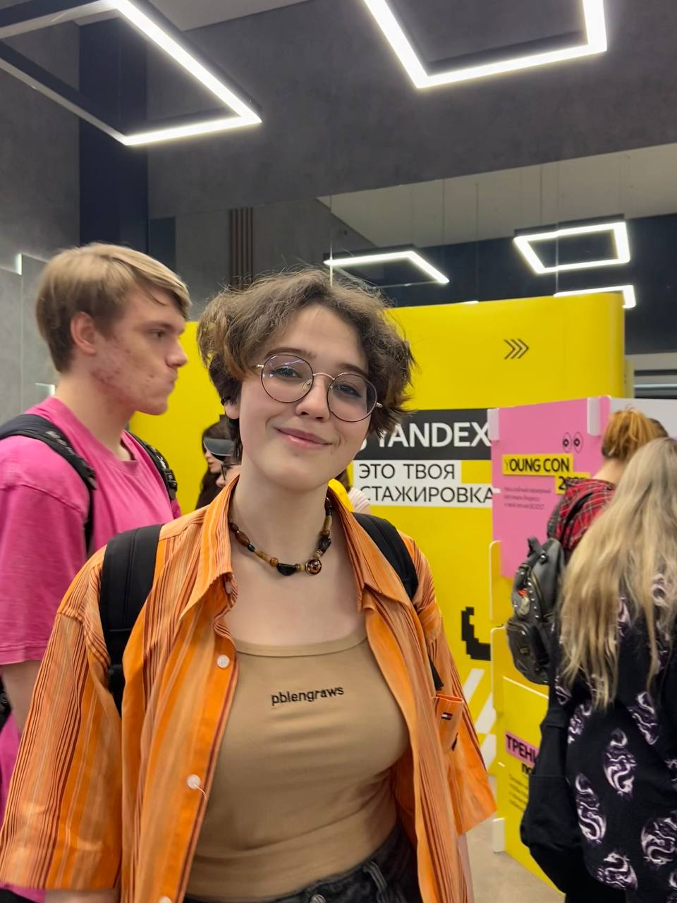
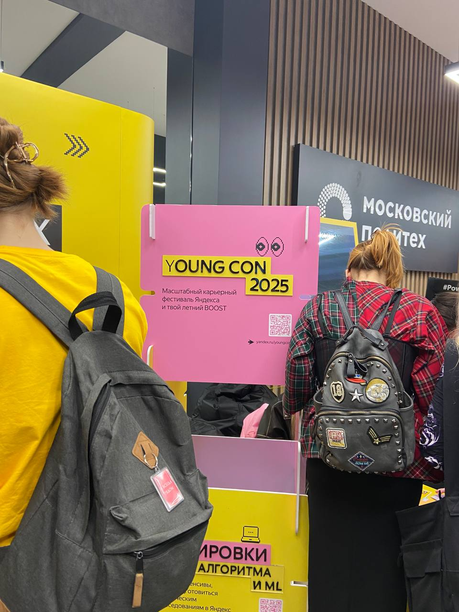
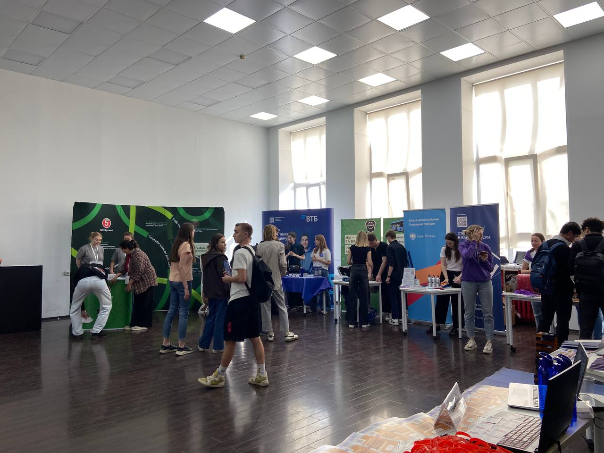

# Отчет о посещении мероприятия «Карьерный Марафон»
## Введение

**Цели мероприятия:**

•	Знакомство с работодателями – студенты могут пообщаться с представителями компаний, узнать о вакансиях и стажировках.

•	Развитие карьерных навыков – проводятся мастер-классы, тренинги и консультации по резюме, собеседованиям и soft skills.

•	Нетворкинг – возможность завести полезные знакомства с профессионалами из разных отраслей.

•	Трудоустройство – некоторые компании проводят собеседования прямо на мероприятии.

•	Профориентация – помогает студентам понять, в каком направлении развиваться.

**Дата и место проведения:** 22 апреля, Главный корпус Московского политехнического университета (Большая Семеновская 38), 15:00-18:00 (3 часа)

**Организаторы:** Московский политехнический университет
Описание мероприятия

Для дальнейшей практической работы я решила сосредоточить свое внимание на стенде YOUNG&&YANDEX

**Формат мероприятия:** Выставка предприятий, мастер-класс

На мероприятии, организованном при поддержке Яндекса, обсуждалась роль компании в развитии игровой индустрии России. Эксперты рассказали о ключевых направлениях работы, технологических решениях и перспективах сотрудничества с разработчиками.

## Кто такой Яндекс?
Яндекс — это не просто поисковик, а многопрофильная IT-корпорация, которая развивает поисковые технологии и рекомендательные системы:

•	Цифровые сервисы (Яндекс.Такси, Еда, Музыка, Карты, Маркет)

•	Облачные платформы (Yandex Cloud)

•	Искусственный интеллект (голосовой помощник Алиса, компьютерное зрение)

•	Образовательные проекты (Яндекс.Практикум, Школа анализа данных)

**Миссия компании:** "Создавать технологии, которые помогают людям решать повседневные задачи и получать новые возможности".

## 1. Яндекс и игровая индустрия

**Основные направления работы**

Яндекс не разрабатывает AAA-игры, но активно интегрирует игровые технологии в свои сервисы:

Платформа "Яндекс Игры" (yandex.ru/games)
Что это? Бесплатный сервис для запуска браузерных и мобильных игр без скачивания.

•	Формат: HTML5-игры, казуальные проекты, головоломки.

•	Монетизация: реклама (видео, баннеры) и подписки.

**Примеры хитов:**

•	"Космические рейнджеры" (релиз 2023)

•	"Маджонг", "Солитер" (классика с миллионами игроков)

Студия OMG! (ex-Ongame)

Чем занимается? Разрабатывает гиперказуальные мобильные игры с упором на простой геймплей.

Известные проекты:

•	"Бабушка Дача" (симулятор садовода)

•	"Слово Пацана" (словесная головоломка)

**Философия:**

"Наши игры должны захватывать с первых секунд и не требовать долгого обучения".

Технологии для разработчиков

•	Yandex Cloud: хостинг для мультиплеерных игр и аналитика.

•	Яндекс.Толока: сбор данных для обучения игрового ИИ.

•	Алиса в играх: голосовое управление и озвучка персонажей.

## 2. Цели и стратегия в игровой сфере

Яндекс фокусируется на:

	Доступности (игры работают даже на слабых устройствах)

	Интеграции (связь с другими сервисами: Музыкой, Картами)

	Data-driven разработке (анализ поведения игроков через Яндекс.Метрику)

Пример:

Игра "Слово Пацана" использует AI-алгоритмы Яндекса для генерации уровней под интересы пользователя.

## 3. Темы и тренды

На мероприятии выделили ключевые направления:

•	Облачный гейминг (тестирование стриминга через Яндекс.Браузер) Облачный гейминг (клаудгейминг) — это запуск видеоигр на сервере. С помощью него пользователи могут играть на устройстве со старым «железом» (процессор, оперативная память, видеокарта и так далее). Сервисы позволят играть практически на любом устройстве, даже самом бюджетном. Главное условие — стабильное подключение к интернету.

•	Геймификация сервисов (мини-игры в приложении "Яндекс")

•	VR/AR-эксперименты (дополненная реальность в Картах)

Проблемы:

•	Конкуренция с VK Play и My.Games

•	Сложности с монетизацией hardcore-игр

## 4. Возможности для студентов

Яндекс предлагает:

•	Стажировки в OMG! (гейм-дизайн, иллюстрация)

•	Хакатоны по созданию мини-игр для Алисы

•	Бесплатные курсы по игровой аналитике (Яндекс.Практикум)

## 5. Вывод

Яндекс не заменяет классических игровых гигантов, но создаёт уникальную экосистему для:

•	Разработчиков (инструменты, аналитика, аудитория).  Малым и средним студиям сложно конкурировать с гигантами вроде Electronic Arts или Ubisoft. Яндекс предлагает готовую инфраструктуру, чтобы сократить путь от идеи до релиза.

•	Игроков (бесплатный доступ к качественным проектам). 70% геймеров в России не готовы платить за игры, но активно играют в свободное время. Яндекс закрывает этот спрос.

•	Студентов (возможность войти в индустрию). 

Рекомендации:

Следить за вакансиями на career.yandex.ru

Участвовать в конкурсах на yandex.ru/games

## Итоги и выводы

**1. Определение формата и платформы**

Что учесть:

Яндекс делает ставку на казуальные и гиперказуальные игры — это значит, что мой проект может быть простым в освоении, но с аддиктивным геймплеем (как «Бабушка Дача»). Лучше стартовать с мобильной или браузерной версии (HTML5, Unity WebGL).

**2. Монетизация и продвижение**

Опыт Яндекса:

•	Реклама — основной источник дохода для казуальных игр (баннеры, видео).

•	Подписки работают для премиум-контента (например, отключение рекламы).

Как применить:

•	Добавить нативную рекламу (например, «Посмотрите видео и получите бонус»).

•	Использовать соцсети (как Яндекс Игры продвигают проекты через свои сервисы).

**3. Техническая реализация**

Инструменты, которые стоит рассмотреть.

Для мобильных игр: Unity (C#) или Godot (GDScript).

Для браузерных игр: Phaser (JavaScript) или Construct 3 (no-code).

Для аналитики: Яндекс.Метрика или Firebase.

Важно оптимизировать игру под слабые устройства (как это делает Яндекс) и протестировать скорость загрузки — это критично для удержания игроков.

 **4. Работа с аудиторией**

Принципы Яндекса:

•	Data-driven дизайн: Анализируйте поведение игроков (где «вылетают», что пропускают).

•	A/B-тестирование: Пробуйте разные версии уровней или интерфейса.

Как внедрить:

Создать анкету для игроков (Google Forms).

Запустить тестовую версию для друзей/одногруппников.

Собрать фидбэк и доработайте механики.

**5. Вдохновение и нетворкинг**

•	Изучить топы Яндекс Игр — какие жанры сейчас популярны?

•	Посмотреть лекции OMG! на YouTube (как они создают игры).

**Как расширить профессиональные связи:**

Участвовать в хакатонах (например, от Яндекса или VK).

Публиковать процесс разработки в Telegram или LinkedIn — это может привлечь внимание издателей.

**Итоговый чек-лист проекта.**

Концепция:

•	Выбрать жанр (головоломка, симулятор, аркада).

•	Определить ЦА (студенты, школьники, взрослые).

Технологии:

•	Движок (Unity, Godot, др.).

•	Платформа (мобильная, браузерная, ПК).

Монетизация:

•	Реклама (тип и места размещения).

•	Донаты/подписки (если нужно).

Продвижение:

•	Страница в соцсетях.

•	Публикация на площадках (itch.io, Яндекс Игры).

Аналитика:

•	Настроить сбор данных (Google Analytics, Яндекс.Метрика).

•	Запланировать доработки по фидбэку.

**Главный вывод:**

Опыт Яндекса показывает, что успешная игра — это не сложная графика, а удобный геймплей, четкая монетизация, постоянный контакт с игроками.

## Фотоотчет

