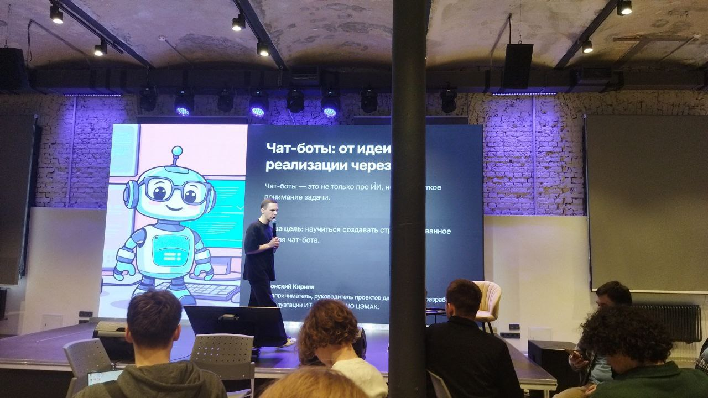
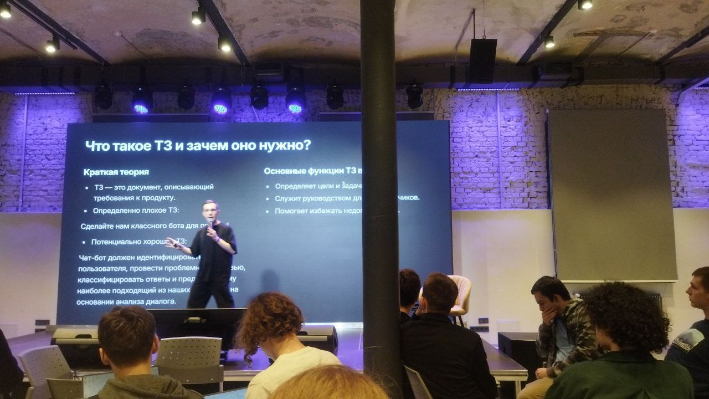
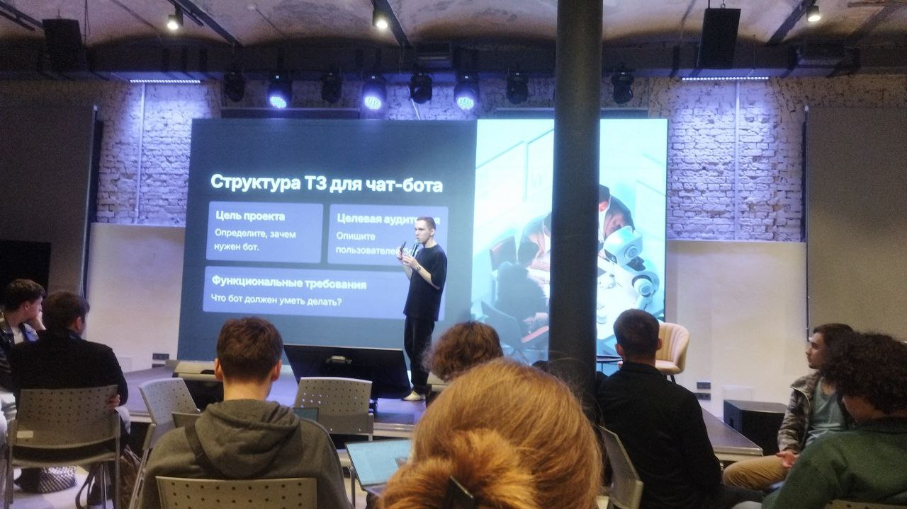
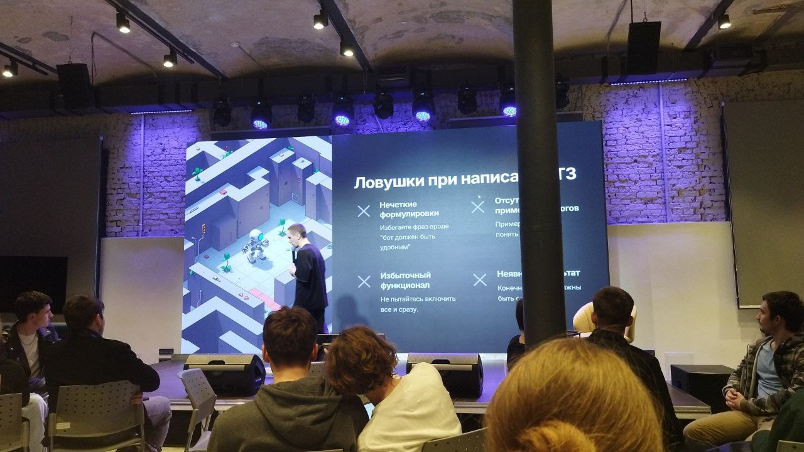
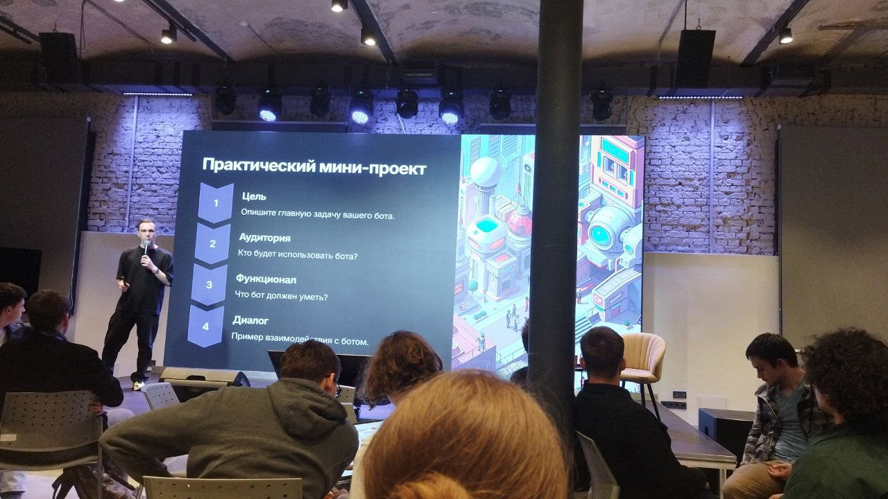
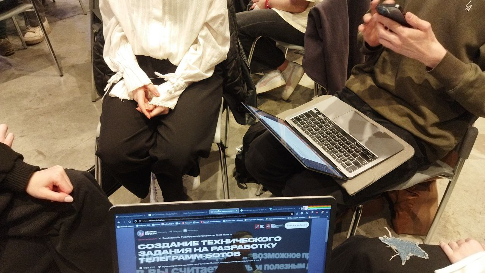
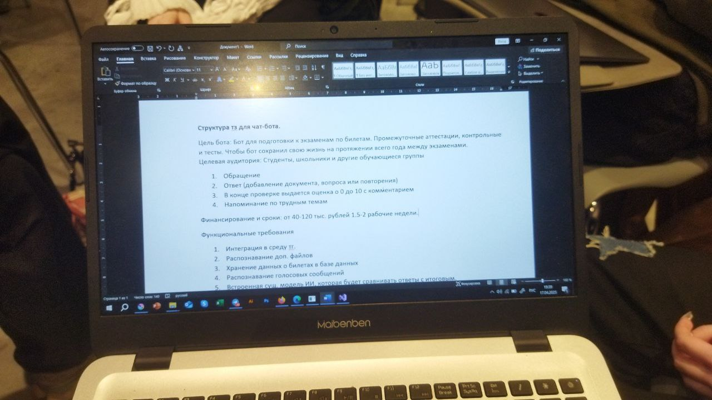

# Отчет о посещении мероприятия «Создание технического задания на разработку чат-ботов»

## Введение

**Цели мероприятия**:
- Изучение порядка создания технического задания, которое поймет каждый
- Изучение составных частей базовой структуры технического задания
- Раскрыть секреты написания хорошего технического задания

**Дата и место проведения**:  
17 апреля 18:00-20:00 (2 часа), Мультиформатное пространство «Молодёжь Москвы»

**Организаторы**:
- Академия «Молодежь Москвы»
- Московский политехнический университет
## Описание мероприятия

**Формат мероприятия**:
- Лекция
- Мастер-класс
- Практика

**Спикеры/кураторы**:  
Уклонский Кирилл - Руководитель проектов департамента разработки и эксплуатации ИТ решений АНО "ЦЭМАК"

**Программа мероприятия**:
1. Чат-боты: от идеи до реализации - рассуждение о том, что такое чат-боты и какие цели они выполняют
2. Что такое ТЗ и зачем оно нужно
3. Структура ТЗ для чат-бота
4. Ловушки при написании ТЗ
5. Практический мини-проект

**1. Чат-боты: от идеи до реализации**
Чат-боты - это не только про ИИ, но и про четкое понимание задачи.

**Пример использования чат-бота**:  
В недавнем времени я пользовалась чат-ботом «Макс» на Госуслугах. Чат-бот Макс помогает пользователям:
- Получать нужную информацию
- Пользоваться различными услугами

**Возможности Макса**:
- **Формирование поисковых подсказок**:  
  Бот отображает на главной странице список новинок, которые могут заинтересовать пользователей в зависимости от региона, возраста и пола.
  
- **Предоставление личных данных**:  
  Позволяет получить нужные сведения и скопировать их в буфер обмена, когда пользователь не может найти их на портале.
  
- **Заполнение заявлений**:  
  Некоторые заявления заполняются прямо в диалоге с Максом, включая:
  - Запись к врачу
  - Заказ выписки из электронной трудовой книжки
  - Онлайн-выписки об объекте недвижимости
  - Справки о размере пенсии

**Личный опыт**:  
Мой последний опыт использования был связан с поиском и оформлением необходимых справок для ЗАГСа.
**2. Что такое ТЗ и зачем оно нужно?**

**Краткая теория**:  
ТЗ (Техническое задание) – это документ, описывающий требования к продукту.

**Примеры ТЗ**:
- ❌ Плохое ТЗ:  
  «Сделайте нам классного бота для покупателя»
  
- ✅ Хорошее ТЗ:  
  «Чат-бот должен:
  - Идентифицировать пользователя
  - Проводить анализ проблем
  - Классифицировать ответы
  - Предлагать релевантные решения на основе анализа диалога»

**Конкретный пример для интернет-магазина**:
1. Определять тип запроса (доставка, возврат, ассортимент)
2. Принимать номер заказа и отображать его статус
3. Переключать на оператора при сложных вопросах

**Функции ТЗ**:
- ✔ Фиксация договорённостей (исключает разночтения)
- ✔ Снижение риска переделок (экономия ресурсов)
- ✔ Критерии для тестирования результата

---

#### Практический опыт работы с ТЗ
**Проект для издательств**:  
«Книжное издательство ЭКСМО» и «Книжное издательство БОМБОРА»

**Пример ТЗ на дизайн обложки**:

**Жанр**: некнижная продукция  
**ЦА**: Женщины 20-30 лет, ценители эстетики (активные в Pinterest/Instagram)  
**Формат**: 60x84/16  
**Тираж**: 2000 экз. (1000+1000)  
**Технические требования**:
- Материал: офсет 80 (4+4)
- Отделка: глянцевый лак, пленка «Вельвет»
- Особенности: кругление углов

**Текстовые элементы**:
- Лицевая сторона: "Город – как человек..." (тестовый вариант)
- Корешок: нет текста
- Авторская подпись: @lerafromsaintp (органичное размещение)

**Визуальная часть**:
- Референс: [mashmaria.ru/notebook](https://mashmaria.ru/notebook)
- Эмоциональное воздействие: эстетическое наслаждение
- Фото: 16 изображений из папки \\eksmo-office.ru\CO\Exchange\Горюнова\Города Питер

**Ограничения**:
- Не рекомендуется: перегруженный дизайн
- Допускается: творческая свобода в рамках стиля
**3. Основные функции технического задания**

**Ключевые функции ТЗ**:
1. **Определение целей и задач**  
   - Четко формулирует предназначение продукта  
   - Задает критерии успешности реализации

2. **Руководство для разработчиков**  
   - Содержит конкретные технические требования  
   - Описывает ожидаемое поведение системы  
   - Служит основой для оценки трудозатрат

3. **Устранение неопределенностей**  
   - Минимизирует разночтения между заказчиком и исполнителем  
   - Предотвращает "додумывание" требований  
   - Снижает количество доработок

**Пример реализации**:

**Цель**:  
_"Уменьшить нагрузку на службу поддержки, автоматизируя ответы на 70% типовых вопросов"_

**Целевая аудитория**:  
_Покупатели интернет-магазина 25-45 лет, предпочитающие текстовые коммуникации телефонным звонкам_

**Функционал**:
- 📌 База знаний по часто задаваемым вопросам
- 📸 Прием и обработка жалоб с прикрепленными фото
- 🔄 Интеграция с CRM-системой (синхронизация данных о заказах)
- 📊 Логирование обращений для последующего анализа

**Пример диалога**:
```plaintext
Пользователь: Где мой заказ?
Бот: Пожалуйста, введите номер вашего заказа
Пользователь: 123456
Бот: Ваш заказ №123456 находится в пути. 
Трек-номер: ABC123456789. 
Ожидаемая дата доставки: 15.05.2023
```
**4. Структура ТЗ для чат-бота**

**Обязательные разделы**:
- **Цель проекта**:  
  Четкое определение задач бота (1-2 предложения)  
  Пример: _"Автоматизация ответов на частые вопросы клиентов"_

- **Целевая аудитория**:  
  - Демографические данные (возраст, пол)  
  - Техническая грамотность  
  - Основные сценарии использования  

- **Функциональные требования**:  
  - Основные возможности (5-7 ключевых функций)  
  - Ограничения и исключения  
  - Интеграции с другими системами  

---

**5. Типичные ошибки при составлении ТЗ**

**Критические ловушки**:
1. **Расплывчатые формулировки**  
   ❌ _"Бот должен быть удобным"_  
   ✅ _"Время ответа ≤3 сек, меню не глубже 2 уровней"_

2. **Функциональная перегрузка**  
   - Приоритезация по принципу MVP (Minimum Viable Product)  
   - Четкое разделение на "обязательно" и "по возможности"

3. **Отсутствие примеров**  
   - Включение 3-5 типовых диалогов  
   - Описание обработки ошибок  

4. **Неопределенность результата**  
   - Конкретные метрики успеха  
   - Критерии приемки  

---

**6. Практический мини-проект**

**Шаблон для заполнения**:

**1. Цель**:  Опишите главную задачу вашего бота

**2. Аудитория**:  На кого будет направлен бот?  

**3. Функционал**:  Что бот должен уметь? 

**4. Диалог**: Пример взаимодействия с ботом 

**5. Сроки и Финансы**: За какие сроки будет готов бот и какие средства на него будут направлены?

### Практическая часть  
**Задание**: Создание ТЗ для личного чат-бота.  

**Бот**  
Цель работы: Бот для подготовки к экзаменам по билетам. Промежуточные аттестации, контрольные и тесты. Чтобы бот сохранил свою жизнь на протяжении всего года между экзаменами.  

**Целевая аудитория**:  
- Студенты, школьники и другие обучающиеся группы  
- Студенты, школьники готовящиеся к экзаменам, тестам, контрольным и т.д.  
- Люди, изучающие какой-либо материал на проверку знаний (сотрудники на стажировке, автолюбители сдающие на права и т.д.)  

**Функциональные требования**:  
1. Интеграция в среду телеграмма  
2. Распознание .docx файлов  
3. Хранение данных о билетах в БД  
4. Распознание голосовых сообщений  
5. Интеграция с существующей моделью  
6. Напоминания об учёбе  
7. Описание ошибок и оценка знаний пользователя (от 0 до 10)

**Диалог**:  
USER: /start  
BOT: 👋 Привет! Я помогу тебе готовиться к экзаменам 📚 Используй /add чтобы добавить вопрос или /add_doc или /test чтобы пройти проверку.  

// Добавление вопроса  
USER: /add  
BOT: Введите формулировку вопроса  
USER: <Вопрос>  
BOT: Теперь введите эталонный ответ на этот вопрос:  
USER: <Ответ>  
BOT: Вопрос успешно добавлен  

// Добавление документа  
USER: /add_docx  
BOT: Отправьте документ  
USER: <Документ>  
BOT: Документ с вопросами успешно добавлен  

// Проверка знаний  
USER: /test  
BOT: 🧠 Вопрос: <вопрос>  
USER: <Ответ текстом> / <Ответ голосом> / Не знаю  
BOT: <Оценка: (от 1 до 10)>  
<Комментарий: (что правильно, что нет, что стоит добавить)>  

// Напоминание  
BOT: Самое время повторить материал)  

Финансирование:  
1. Реклама в конце действий  
2. Гранты от государства и частных компаний  
3. Подписка (в перспективе успеха бота для использование премиальных функций)  

Финансовый-денежные затраты:  
40 000 - 120 000 Рублей / 40-80 рабочих часов

### Итоги и выводы  
Приобретенные навыки: Составление ТЗ, анализ требований, проектирование диалогов  
Польза для практики: После данной лекции я смогла лучше понять всю важность написания ТЗ, узнать его структуру, а так же на практике написать свое собственное ТЗ. Я думаю это будет очень полезно мне в будущем, так как вариативная часть моей практики и курсовой проект это игра, где ТЗ необходимо.

### Фотоотчет
Лекция: Чат бот от идеи до реализации



Лекция: Что такое ТЗ и для чего оно нужно



Лекция: Структура ТЗ для чат бота



Лекция: Ловушки при написании ТЗ



Лекция: Практический мини-проект



Лекция: Выстпление участников


Лекция: Процесс командной работы



Лекция: Написание личного ТЗ



Лекция: Личное фото на мероприятии


